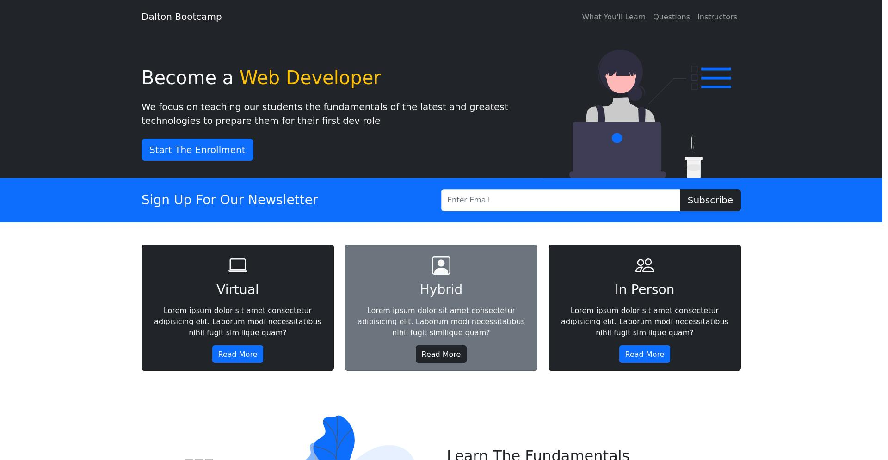

<div align="center">
  <h2 align="center">Prixima - Digital Agency Website</h2>

Dalton Bootcamp is a fully responsive digital agency website, <br />Responsive for all devices, built using HTML, CSS, JavaScript and Bootstrap.

## <a href="https://ubongjacob.github.io/Dalton_Bootcamp"><strong>➥ Run a Live Demo Of This Project </strong></a>

</div>

<br />

### Demo Screenshots

<div background-color="red" >

<br/>

</div>

### Credit and Acknowledgment

This repo is a modified build of the Video linked below and was created to learn about HTML,CSS,jQuery and Bootstrap. Most Credits goes to the YouTube Channel linked below

- [YouTube Video Link](https://youtu.be/4sosXZsdy-s)
- [YouTube Channel Link](https://www.youtube.com/c/TraversyMedia)

<br/>

### Prerequisites

Before you begin, ensure you have met the following requirements:

- [Git](https://git-scm.com/downloads 'Download Git') must be installed on your operating system.

### Run Locally

To run **Dalton Bootcamp** locally, run this command on your git bash:

Linux and macOS:

```bash
sudo git clone https://ubongjacob.github.io/Dalton_Bootcamp.git
```

Windows:

```bash
git clone https://ubongjacob.github.io/Dalton_Bootcamp.git
```

### <a href="https://ubongjacob.github.io/Dalton_Bootcamp"><strong>➥ Live Demo</strong></a>

### Contact or Connect with me:

If you want to contact with me you can reach me at [Twitter](https://www.twitter.com/ubonggjacob) or [Linkedin](https://www.linkedin.com/in/ubonggjacob)
<br />
<a href = "https://www.linkedin.com/in/ubonggjacob"></a>
<a href = "https://twitter.com/UbonggJacob"></a>

### License

This project is **free to use** and does not contains any license. Once again most intellectual property right is refrenced on the credit section above
